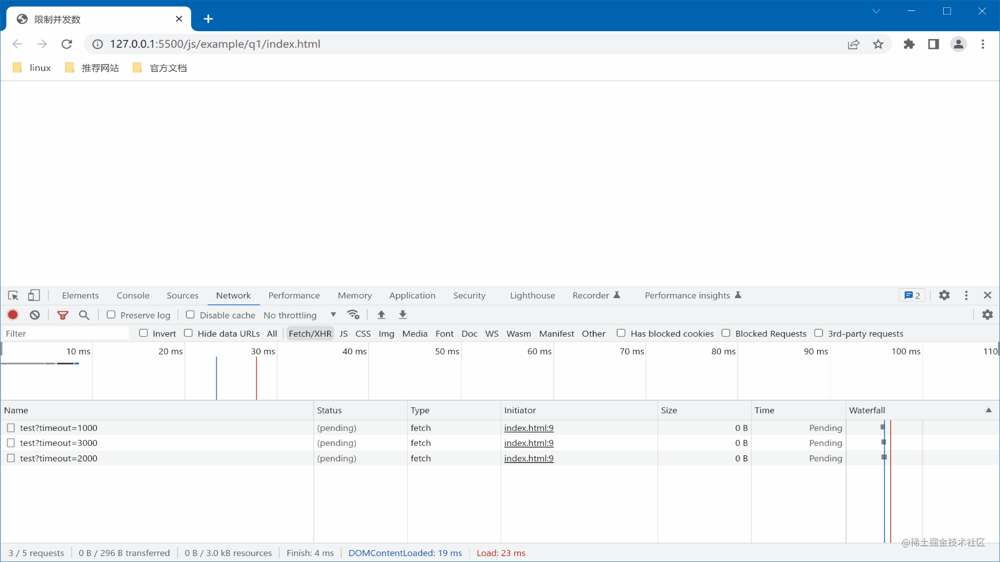

# 1、限制并发数
有 10 个异步请求，如何保持同时 3 个并发?

## 解决办法
方式一：这里使用 <b>Promise.race</b> 来实现。  
方式二：这里使用 <b>删除请求时新增</b> 来实现。

## 基本流程

方式一：

- 创建一个大小为 3 的请求池
- 立刻填充最多 3 个请求构造的 promise
- 立刻执行 Promise.race
- 删除已完成请求的 promise，并加入一个新的
- 重复 Promise.race，直到完成所有请求

方式二：

- 创建一个大小为 3 的请求池
- 立刻填充最多 3 个请求构造的 promise
- promise 中异步请求完成时，删除当前 promise，加入一个新的 promise 到请求池中

## Q1：发起的异步请求可以是 promise 数组吗？

<b>不可以。</b>
如果你传入了一个 promise 数组，这时所有的请求已经发出了。我们想要的是有 10 个请求准备发出（未发出）。

```js
function query(timeout) {
  return new Promise((resolve) => {
    setTimeout(() => resolve(x), x);
  });
}

// promise数组
const requestPmList = [100, 200, 300].map((x) => query(x));

// 函数数组
const requestList = [100, 200, 300].map((x) => () => query(x));
```

## Q2：如何删除一个已完成的请求呢？

我们把异步请求函数封装成一个 promise。<br />
当 Promise.race 获取到最新请求结果时，在请求池中删除这个 promise。

```js
function createNewRequest(request) {
  const newRequest = request().then((res) => {
    concurrentArr.splice(concurrentArr.indexOf(newRequest), 1);
    return res;
  });
  return newRequest;
}
```

## 完整代码

```js
const timeoutArr = [1000, 3000, 2000, 9000, 8000, 7000, 5000, 3000, 1000, 700];
const requestArr = timeoutArr.map((timeout) => () => query(timeout));
concurrentRequest2(requestArr, 3);

function query(timeout) {
  return new Promise((resolve) => {
    setTimeout(() => resolve(timeout), timeout);
  });
}

// 方法一：使用Promise.race
function concurrentRequest(requestArr = [], concurrent = 3) {
  let i = concurrent;
  const concurrentArr = requestArr.slice(0, concurrent).map(createNewRequest);
  run(concurrentArr);

  function createNewRequest(request) {
    const newRequest = request().then((res) => {
      concurrentArr.splice(concurrentArr.indexOf(newRequest), 1);
      return res;
    });
    return newRequest;
  }

  function run(concurrentArr) {
    if (!concurrentArr.length) return;
    Promise.race(concurrentArr).then((res) => {
      console.log("弹出: ", res);
      if (i < requestArr.length) {
        concurrentArr.push(createNewRequest(requestArr[i++]));
      }
      run(concurrentArr);
    });
  }
}

// 方法二：删除请求时新增
function concurrentRequest2(requestArr = [], concurrent = 3) {
  let i = concurrent;
  const concurrentArr = requestArr.slice(0, concurrent).map(createNewRequest);

  function createNewRequest(request) {
    const newRequest = request().then((res) => {
      console.log("弹出: ", res);
      concurrentArr.splice(concurrentArr.indexOf(newRequest), 1);

      if (i < requestArr.length) {
        concurrentArr.push(createNewRequest(requestArr[i++]));
      }
      return res;
    });
    return newRequest;
  }
}
```

## 运行结果


<br>
<br>
[代码地址：有 10 个异步请求，如何保持同时 3 个并发？](https://github.com/tangjiahui-cn/codes/tree/master/js/example/q1)
<br>
