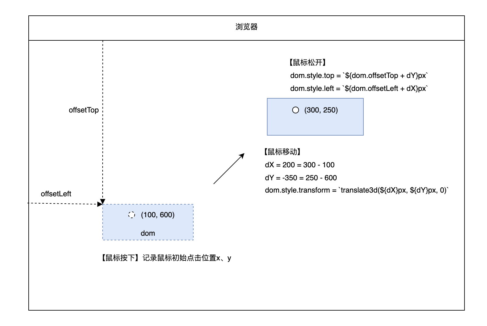

# 一个高性能的DOM节点拖拽方案，适用于各框架
## 一、使用 translate3d 做移动时定位
&emsp;&emsp;首先，我们需要了解页面重排和重绘的相关知识：
> <b>重排：</b> dom节点的几何属性变化，触发重排和重绘，会绘制DOM树和CSS树。
> 
> <b>重绘：</b> dom节点的样式发生变化，触发重绘，局部绘制某些元素的外观。

&emsp;&emsp;如果我们使用绝对定位进行移动时定位，不断设置节点的top和left属性，则会不断触发重排，对资源消耗巨大。所以我们可以选择translate 和 translate3d，避免重排。同时，为了享用GPU加速，最终选择translate3d。
## 二、实现原理
-  目标节点使用绝对定位，脱离文档流
-  鼠标按下时记录点击坐标
-  鼠标移动时不断计算 translate3d 的偏移量（节流移动）
-  鼠标松开时重置节点位置



关于为什么要使用offsetX?

使用拖拽组件的场景很复杂，一般是在一个父容器内进行拖拽，而父容器的位置是不确定的。我们使用 [offsetTop](https://developer.mozilla.org/zh-CN/docs/Web/API/HTMLElement/offsetTop) 确保是相对于最近的定位元素进行定位，如给父元素加上relative。
## 三、代码示例
```html
<!DOCTYPE html>
<html>

<head>
    <style>
        .container {
            position: relative;
            background-color: whitesmoke;
            border: 10px solid black;
            height: calc(100vh - 150px);
            margin-top: 100px;
            margin-left: 100px;
            overflow: auto;
        }

        .dom {
            position: absolute;
            top: 100px;
            left: 100px;
            width: 150px;
            height: 150px;
            background-color: red;
            display: inline-block;
            border: 2px solid black;
        }
    </style>
</head>

<body>
    <div class="container">
        <div class="dom" id="dom"></div>
    </div>

    <script>
        let $ = id => document.getElementById(id)
        let block = $('block')
        let startPos = { x: -1, y: -1 }

        const handleMouseMove = throttle(e => move(e), 8)

        function throttle(fn, delay) {
            let timerId, that = this
            return function () {
                if (!timerId) {
                    fn?.apply(that, arguments)
                    timerId = setTimeout(() => timerId = null, delay)
                }
            }
        }

        dom.onmousedown = function (e) {
            startPos = { x: e.x, y: e.y }
            window.addEventListener('mousemove', handleMouseMove)
            window.addEventListener('mouseup', handleMouseUp)
        }

        function move(e) {
            const dX = e.x - startPos.x
            const dY = e.y - startPos.y
            dom.style.transform = `translate3d(${dX}px, ${dY}px, 0)`
        }

        function handleMouseUp(e) {
            const offsetLeft = dom.offsetLeft + (e.x - startPos.x)
            const offsetTop = dom.offsetTop + (e.y - startPos.y)
            dom.style.left = offsetLeft + 'px'
            dom.style.top = offsetTop + 'px'
            dom.style.transform = 'translate3d(0, 0, 0)'
            window.removeEventListener('mousemove', handleMouseMove)
            window.removeEventListener('mouseup', handleMouseUp)
        }
    </script>
</body>
</html>
```
